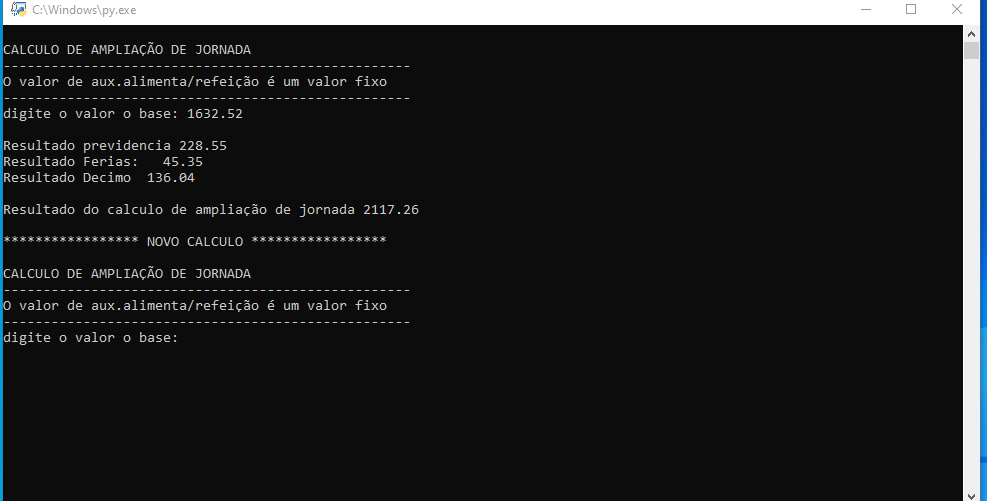

# Calculadora de Ampliação de Jornada
Esse script foi desenvolvindo afim de facilitar a vida da adminitração do RH da Secretaria do Turismo Cultura e Esporte de Florianópolis, o script calcula o valor total de ampliação de jornada com base no salário base, considerando férias, décimo terceiro, previdência, e um valor fixo de auxílio alimentação/refeição.

# Propósito
Uma solução mais rápida e ágil em comparação com a abertura da planilha diretamente nos computadores com desempenho limitado (no caso os computadores da secretaria). 

# Uso
Este script solicita ao usuário o valor do salário base e realiza os cálculos necessários para determinar o valor total da ampliação da jornada, exibindo os resultados no console.

# Instruções
Abra o script:

Execute o script em um ambiente Python para interagir com a calculadora.
Digite o valor base:

Insira o valor do salário base quando solicitado.
Resultado:

O script calculará a previdência, férias, décimo terceiro e um valor fixo adicional para mostrar o resultado final da ampliação de jornada

# Exemplo de Saída
Ao executar o código, a saída será similar à seguinte:

